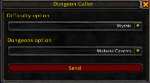
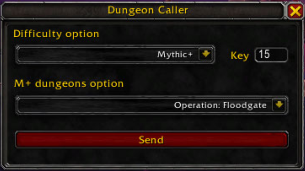
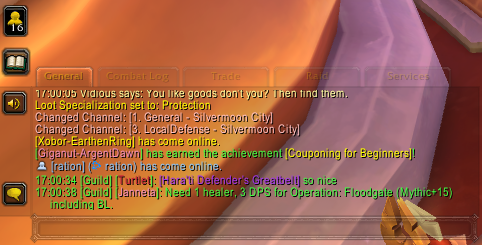
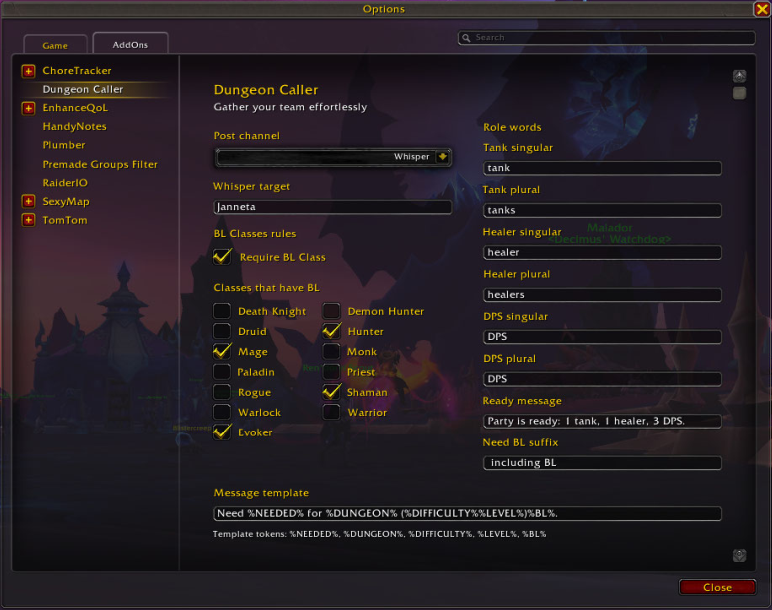

# DungeonCaller

DungeonCaller automatically determines which roles are missing in your party for dungeon runs and sends an auto-generated LF message to the selected channel.

## Installation

Download [DungeonCaller](https://github.com/JurajNyiri/DungeonCaller/archive/refs/heads/main.zip) and extract it into your World of Warcraft directory: `\World of Warcraft\_retail_\Interface\AddOns\DungeonCaller`.

## Usage

After installation, you will see a new minimap icon.

- When you left-click it, you can choose the dungeon difficulty and the dungeon itself, then click **Send**.
- When you right-click it, you can fully customize the message and set the target channel for posting (including whispers).

## Screenshots

### Mythic

- Left-click: selected Mythic run for a specific dungeon.

### Mythic+

- Left-click: selected Mythic+ run for a specific dungeon in the current rotation.

### Guild

- Message sent to guild chat via the **Send** button or `/dc`.

### Settings

- Settings panel for full message customization and other addon options.

